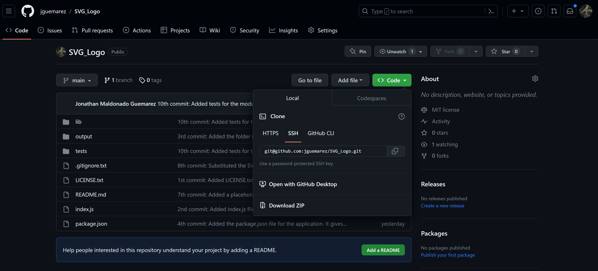
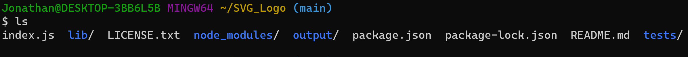
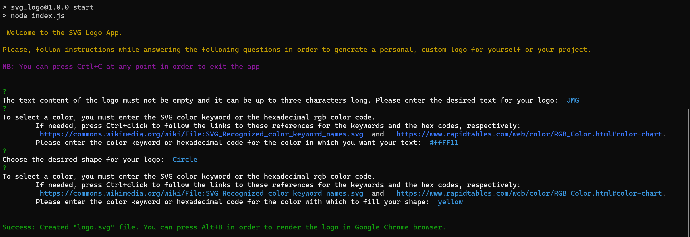
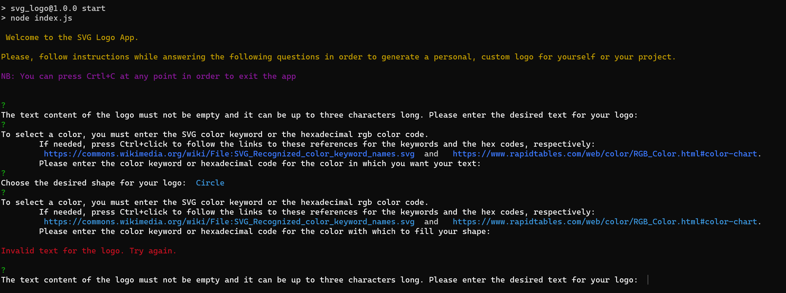
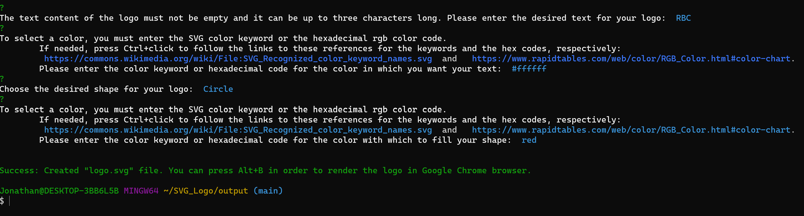
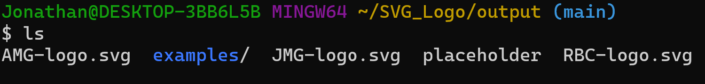
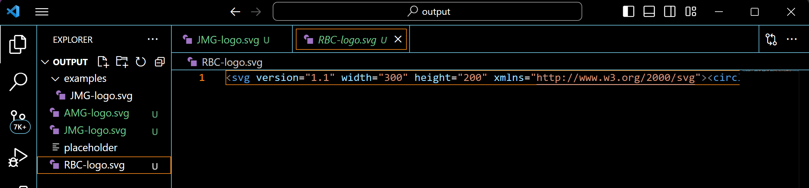
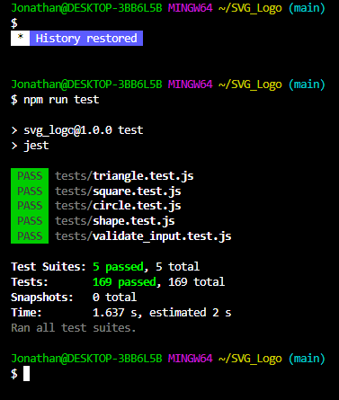

# SVG Logo Generator

## Description

With the purpose of offering a simple and intuitive CLI app that could generate a good-quality SVG logo for the user we undertook this project. After the user starts the app, he/she will be prompted to enter some inputs. The data obtained will be employed to generate an XML .svg file that can be rendered in the browser, offering an image that can be used as a personal brand statement in any of the user's projects without the decay in quality (pixelization) that raster images present while being zoomed in. This project was also an opportunity to learn how to write and conduct tests for classes/constructors and functions using the JEST package and to practice the modularization of code, with the corresponding operations of exporting and importing from them, that is at the heart of the Node.js style of scripting.

## Table of Contents

- [Installation](#installation)
- [Usage](#usage)
- [Credits](#credits)
- [License](#license)

## Installation

In order to install this open-sourced app in your local machine, do the following:

1. On your local machine, create or select a directory where you wish to save all the modules and dependencies of the app.

2. Navigate to <https://github.com/jguemarez/SVG_Logo>.

3. Once you are in the remote repo, click the "Code" button and using some protocol like HTTPS or SSH, clone the repo using the URL provided. You must add the provided URL as that of the remote repo (use the "git remote add origin URL" command in git bash if the directory is initialized as a repo.):

4. Navigate to the directory where you cloned the repo using the CLI of your choice (e.g. Git Bash) and run the command "npm i" in order to install the depencies listed in the package.json file.

## Usage

In order to use the CLI app to create some logos, do the following:

1. Navigate to the folder conatining the modules and dependencies for the project using the CLI. By using the "ls" command in Git Bash, you will see the structure of the project:

2. While staying in the root folder, you can start the app by typing either "npm start", "node index.js", or "node index". In that case, the following text will be printed to the console, walking the user through four questions the answers to which will determine the final look of the logo:

Note: after either typing your answer or selecting it from a list, you need to press the "Enter/Return" key. In the case of the fields asking for color, we added links to relevant documentation as an aid to the user so they can choose either a valid SVG color keyword or a valid hexadecimal RGB color code.

3. In case the user enters an invalid input in the fields dealing with the logo's text, the text color or the desired color with which to fill the selected shape, a message (in red) will be logged to the console alerting the user and he/she will be prompted again for answers:

If the user succesfully enters valid input after a second try, then the following message(in green) is printed to the console:

4. Once the user has successfully answered the questions, he/she can navigate to the output folder by using the "cd output" command. By entering "ls" on the command prompt, the user will see an empty "placeholder" file and as many "logo.svg" files as he/she decides to create with the text-content of the logo preppended to the name of the file.

 

Note: An "examples" subfolder is included. There the user can see samples of the kind of logos that he/she will be able to create.

5. By entering the command "code ." while in the "output" folder, the user will open it in VS Code, allowing him/her to inspect the XML in the .svg files. 

 

6. If the "open in browser v2.0.0" extension is installed, then pressing Alt+B will render the current .svg file in the browser's window:

 

REMINDER: At any point the user can stop using the app by entering Ctrl+C in the terminal.

## Credits

The project is of the authorship of Jonathan Maldonado.The GitHub repo can be found at: <https://github.com/jguemarez/SVG_Logo> .

For more information about installing, using, and testing this app, feel free to watch the walkthrough video hosted in the Google Drive cloud platform at: <https://drive.google.com/file/d/12ced3mjOap9Q6Udqz2d22IL0LckjBmI5/view>

The .gitignore file was lifted from the GitLab class repo: <https://git.bootcampcontent.com>.

This app works in the Node.js JavaScript runtime environment. The latest stable (recommended version) can be found at: <https://nodejs.org/en/download>

We import and make use of the built-in modules "path" and "fs/promises" from the standard library.

We use npm for the specification (semantic versioning) of the app's dependencies and their installation. Here is the URL for the official site of the npm registry: <https://www.npmjs.com>

In particular, we imported "inquirer": "^8.2.4" in Dependencies and  "jest": "^28.1.3" in DevDepencies. You can find the most recent versions here:

<https://www.npmjs.com/package/inquirer> for Inquirer and <https://www.npmjs.com/package/jest> for JEST.

## How to Contribute

If you want to contribute, feel free to fork the repo, modify the repo and then open a pull request. That way I can review the changes before deciding whther to merge them in the codebase or not.

## Tests

By using installing JEST, we were able to devise five testing suites in total: one for each of the Shape, Circle, Square, and Triangle classes in the project and one for the validate_input module. The user can navigate to the directory where the app's files and documentation is found and by entering the command "npm run test", he/she can verify that all of the devised tests are passed:

The fact that our app passes the aforementioned tests strenghtens the belief that it is without bugs. However, the user should keep an eye for any error thrown in the console and, if he/she deems it convenient, to devise more tests. For more information, check out the documentation available at: <https://jestjs.io/docs>.

## Questions

My GitHub username is "jguemarez" and you can checkout my profile at: <https://www.github.com/jguemarez>.
For further questions and comments, you can mail them to the following address: <cantor.dedekind112358@gmail.com>.

## License

This is an open-source project under the terms of agreement provided by the MIT license. 
For more information, click on the following link: <https://opensource.org/license/mit>

